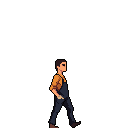
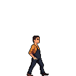
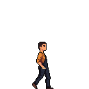
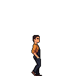
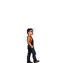
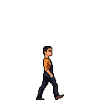
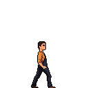
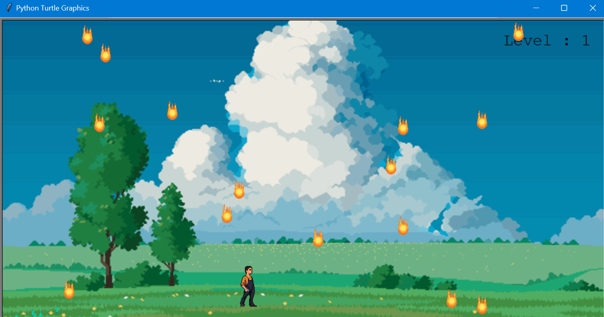
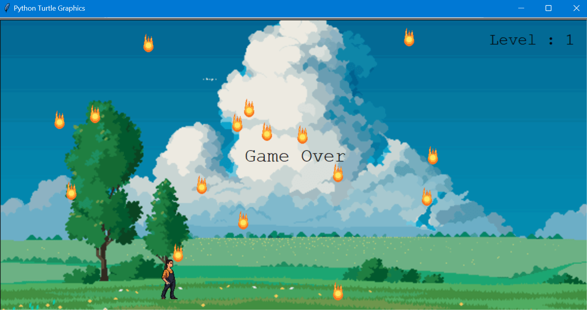

<h1>Turtle Game in Python</h1>
<h3>Brief Overview</h3>
A 2D game built using turtle library in Python using concepts of OOP. 
The player can move left and right and must dodge obstacles to reach the finish line. 
The level increases when the player crosses the finish line. The speed of the moving obstacles increases with each level.
The game ends if the obstacle collides with the player.
<h3>Technologies Used</h3>
<ul>
  <li>Python- 3.11.3</li>
  <li>IDE- Visual Studio Code 1.93.3</li>
  <li>Python libraries- turtle, time, os, random</li>
</ul>
<h3>Screenshots</h3>
<h4>Player Movements</h4>

  
  
  

<h4>Fire Ball Obstacles</h4>

  
  

<h4>In-game screenshots</h4>

